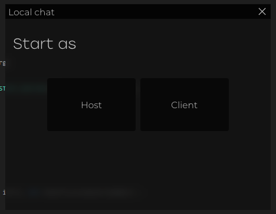
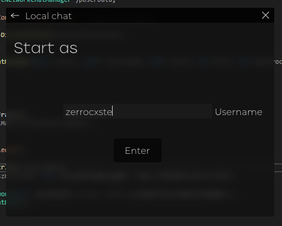
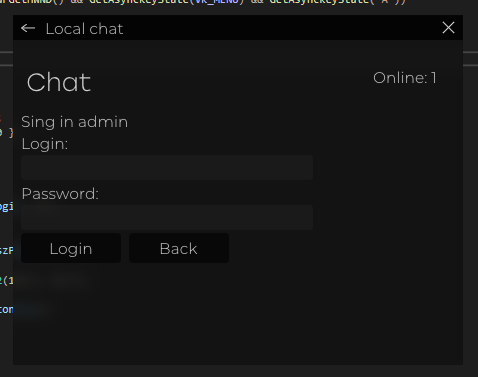
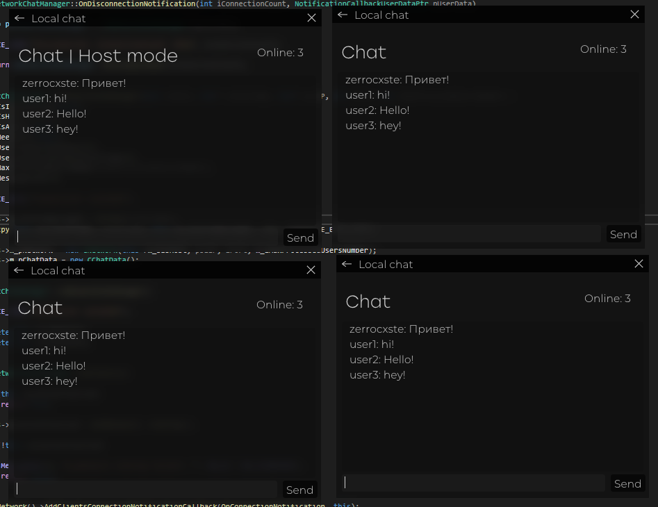

# simple_chat_on_sockets
A simple chat with support for a user count counter (processed manually by the method), attached graphic binding from directx9 + imgui.
The source contains 3 closely related classes: socket class (CNetwork), chat data (CChatData), chat processing class (CNetworkChatManager).
By default, the chat.cpp file in the CNetworkChatManager constructor has the localhost address parameter set.
1. Main

 

2. Login, enter username

 

3. Client sign in admin

 

3. Chat process with 3 clients

 

